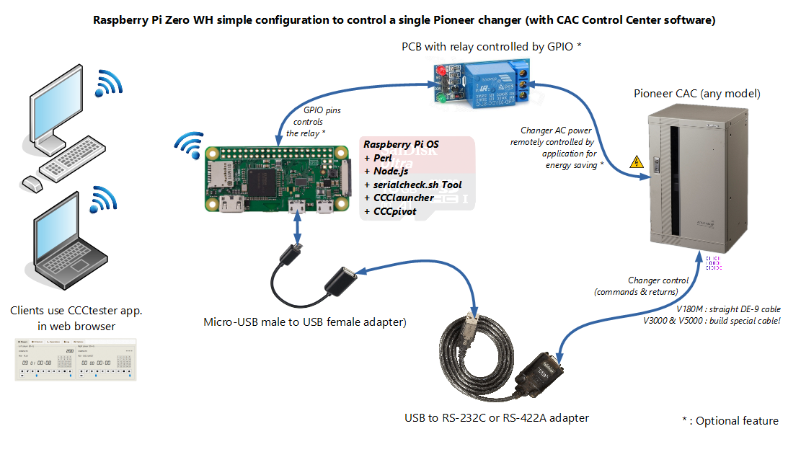
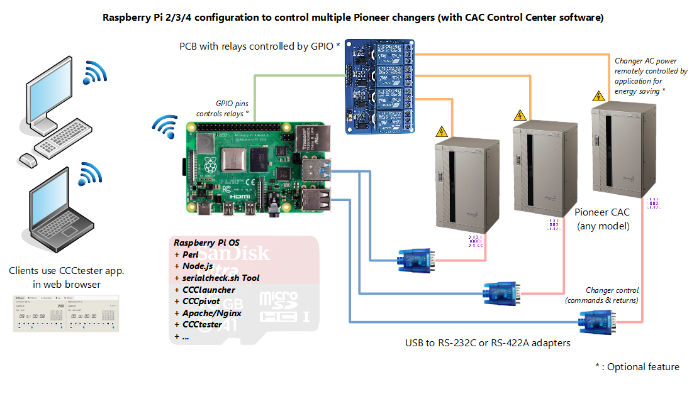

# Using CAC Control Center on a Raspberry Pi

## Usage and performance

I tested my Raspberry Pi Zero WH (armv6l) to act as a Wi-Fi remote access for my CAC-V5000 with the CCCpivot module. Load average of CPU was about 0.20 and <60MB of RAM used in `htop` while communicating (without TLS and node v10.19). So this tiny old model (1×ARM1176JZF-S core of 1Ghz) will clearly do the job in this case.


If you plan to put all modules on your Raspberry Pi, especialy future CCCweb and his database with a webserver, prefer buying a more powerfull model like the Rapsberry Pi 3 or 4 model.



## Installation procedure

This procedure has been tested with success:

- Raspbian Lite (without Desktop) 5.4.51+ 08/2020 / Raspberry Pi Zero WH (armv6l)
- Armbian 20.08.01 / OrangePi PC 1.2 (armv7l)

## 1 - Install Raspberry Pi OS on the SDcard

There is plenty of tutorials for that.

<https://www.raspberrypi.org/documentation/installation/installing-images/>

Use a good SDcard.

## 2 - Configure your SBC

Use 'raspi-config' or 'armbian-config' tool.

- Set passwords
- SSH deamon
- Localisation (Locale, TimeZone, Keyboard Map)
- Wi-Fi (SSID, Passphrase)

Please be sure you can access internet at this step.

## 3 - Some tips

On Raspberry Pi OS:

- don't forget to enable ssh deamon to remote control your Raspi:

```console
sudo systemctl enable ssh
sudo systemctl start ssh
```

- turn off wireless power management if you have dropouts problems.

Add this line to '/etc/rc.local' file (before exit 0):

```console
iwconfig wlan0 power off
```

Reboot and check with 'iwconfig wlan0' that Power Management is off.

## 4 - Install Node.js & NPM

```console
sudo apt-get install nodejs npm
```

Even if the version is not the last one (>=10).

## 5 - Connect your Pioneer CAC autochanger with serial cable

See the [startupGuide.pdf](./startupGuide.pdf).

## 6 - Download and launch serialcheck.sh (check tool)

```console
wget https://raw.githubusercontent.com/duprej/ccc/main/serialcheck.sh
bash serialcheck.sh
```

Before continue, launch this script and confirm that you can control the autochanger at this step. Example:

```console
pi@cacv5000:~ $ bash serialcheck.sh
Welcome to CCC autochanger serial checker script v1.3 for Linux.

This tiny script is interactive and will ask you some questions.
Listing serial ports... 3 found.

Device     | Physical port
------     | -------------
ttyAMA0    | /devices/platform/soc/20201000.serial/tty/ttyAMA0
ttyS0      | /devices/platform/soc/20215040.serial/tty/ttyS0
ttyUSB0    | /devices/platform/soc/20980000.usb/usb1/1-1/1-1.1/1-1.1:1.0/ttyUSB0/tty/ttyUSB0

Please select a serial port:
1) ttyAMA0
2) ttyS0
3) ttyUSB0
#? 3
You have chosen ttyUSB0.
Please select an autochanger model:
1) CAC-V180M
2) CAC-V3000/V3200/V5000
#? 2
You have chosen CAC-V3000/V3200/V5000.
Multiple speed testing mode.
Applying stty settings for 9600 bps...done.
Trying to communicate with the autochanger... Command '1PS?X' send, waiting for reply...
:-) The autochanger replied correctly with '1PSP151206' at 9600 bps.
Dialogue with Pioneer autochanger SUCCEEDED!
Do you want to send custom commands (manual mode) now? Y(es) or any other key for no.
Manual mode entered. Type your autochanger command and press Enter (for each one).
Warning: All chars will be sent as is! There is no verification.
Type 'exit' to terminate this program. Timeout for a command reply is set to 1 second(s).
Command: 1PS?J
1PSE04
Command: 1PS?Z
1PSXXX
Command: exit
Goodbye.
pi@cacv5000:~ $
```

## 7 - Check if you have git

If you don't have it installed:

```console
sudo apt-get install git
```

## 8 - Clone and install CCCpivot

Tip to install lastest Node.js on armv6l (Raspberry Pi Zero) :

```console
wget https://unofficial-builds.nodejs.org/download/release/v14.15.4/node-v14.15.4-linux-armv6l.tar.xz
tar -xvf node-v14.15.4-linux-armv6l.tar.xz -C /usr/ --strip 1
node -v
```

```console
sudo -- bash  -c 'cd /opt && git clone https://github.com/duprej/cccpivot && cd /opt/cccpivot/ && npm install --unsafe-perm'
```

## 9 - Clone and configure CCClauncher

```console
sudo -- bash  -c 'cd /opt;git clone https://github.com/duprej/ccclauncher'
```

Install Perl modules:

```console
sudo apt-get install -y libconfig-simple-perl libdbi-perl libproc-simple-perl libswitch-perl libtext-csv-perl && sudo cpan -iT String::Util
```

Copy the systemd unit file & enable at startup:

```console
sudo cp /opt/ccclauncher/ccclauncher.service /etc/systemd/system/ccclauncher.service && sudo systemctl daemon-reload && sudo systemctl enable ccclauncher
```

Install basic config files:

```console
sudo cp /opt/ccclauncher/conf/* /etc/
```

Configure/Personalize theses files with a text editor (nano, vi, gedit...):

```console
sudo vi /etc/ccclauncher.cfg
sudo vi /etc/cccchangers.csv
```

Start your CCCpivot processes:

```console
sudo perl /opt/ccclauncher/launcher.pl start
```

Check if your CCCpivot processes are alive:

```console
ps -ef|grep node
```

```console
sudo perl /opt/ccclauncher/launcher.pl status
```
