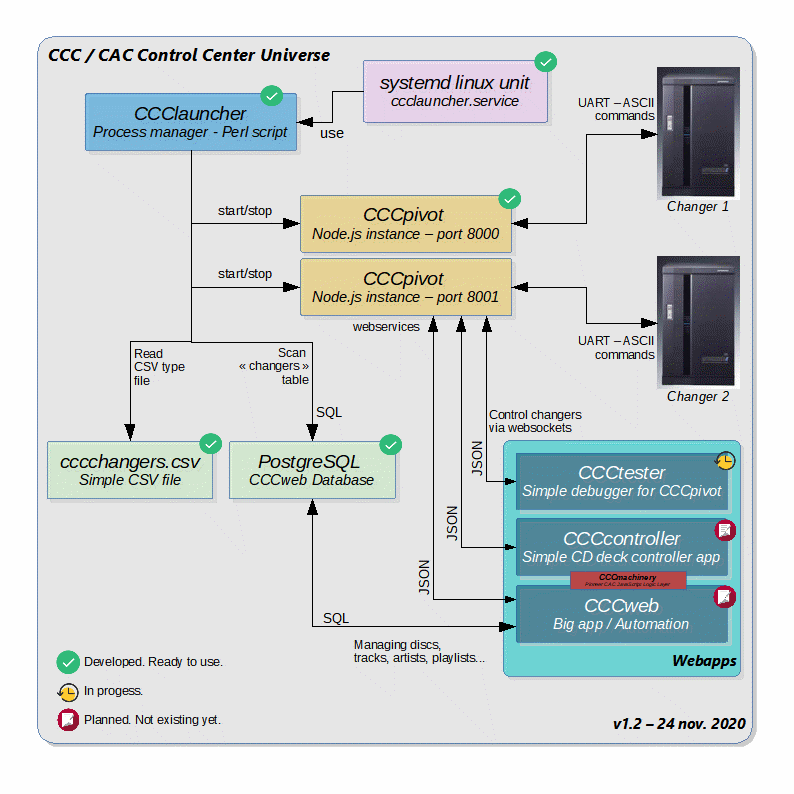
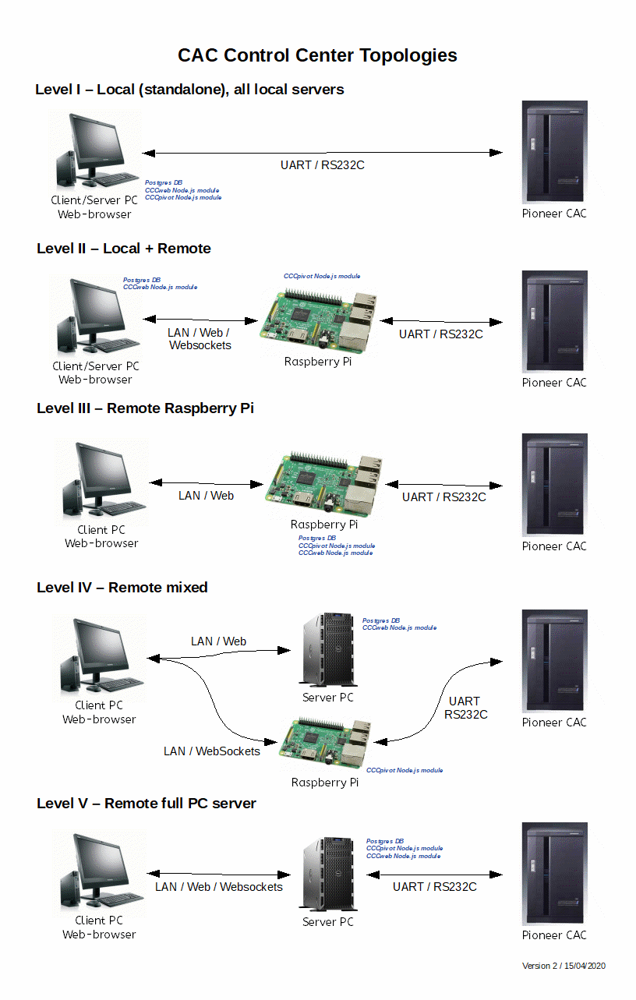
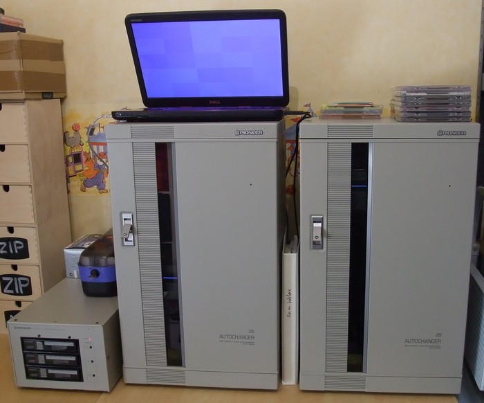
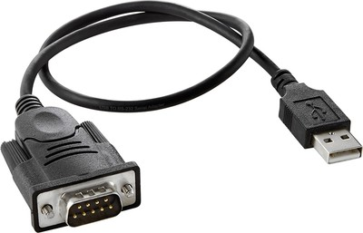
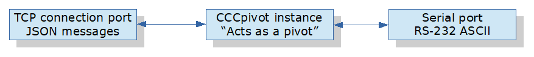

# CAC Control Center (CCC)
## For beginners & ressources

See the [startupGuide.pdf](./startupGuide.pdf) document for quick start guide about Pioneer autochangers hardware.

Official user manuals are located in the [manuals](./manuals/) directory.
Serial programming manuals are located in the [programming](./programming/) directory.

**CCC is not an official Pioneer software.**

**This repository contains only documentation and some basic tools.**

## serialcheck Tool

You can download and use the interactive [serialcheck.sh](./serialcheck.sh) Bash script to test your autochanger easily on Linux.

## At a glance
CAC is an accronym for dedicated Pioneer CD Autochangers CAC-Vxxxx models.
This is the root directory for each modules of the CCC project. 
To understand CCC modules take a look at them (low level to high level) :

| module | description|
|-|-|
| [pivot](https://github.com/duprej/cccpivot) | Node.js script which start a server to control a jukebox via RS-232/422 through a websocket in web browsers.|
| [launcher](https://github.com/duprej/ccclauncher) | Perl script to easily manage (start/status/stop) pivot instances like a Linux deamon.|
| [tester](https://github.com/duprej/ccctester) | Static english web HTML/CSS/JS application to test and debug Node.js pivot instances.|
| controller | Static web HTML/CSS/JS application to control jukebox players (like DJ controller).|
| web | Big application with Postgres database connection and persistance.|

## Differences
Complexity and features will grow crescendo.

| application   | complexity | i18n | multiple jukeboxes | persistance | status collection |
|---------------|------------|------|--------------------|-------------| ------------------|
| CCCtester     | low        | no   | no                 | no          | simple JS timer |
| CCCcontroller | middle     | yes  | no                 | no          | smart/efficient |
| CCCweb        | high       | yes  | yes                | yes         | smart/efficient |

## Topologies/Urbanization
CCC is a complex architecture for reguler users but powerful and versatile for many usages. Modules can be distributed where you want. Of course you can put all modules on an unique computer for easy use.

## Hardware installation
First you have to find a PC computer or a Single Board Computer (like a Raspberry Pi / Orange Pi / Banana Pi...) that will act as a tiny server and connects your autochangers to it with RS-232/422<->USB adapters.
For my part, I used an old laptop like this :

All changers are connected to the computer via USB ports and serial adapters like this :

## The “pivot” concept
CCC is a web-based JavaScript software suite, application modules runs in a web browser like Chrome, Brave, Opera or Firefox. But all of them can’t talk easily with a serial port (before USB accessibility API was developped). This is why there is a module named CCCpivot. To make a bridge between the RS-232C/422A autochanger connection and the TCP/IP/Ethernet network world.

With this solution, your autochangers can be controlled remotely on your LAN/WLAN in all rooms of your house with PCs, tablets or smartphones.

## Linux first
This software/scripts are written to be used in a Linux environment. I planed to use a Raspberry Pi in the long term espacialy for it simplicity, fair price, free software and energy consumption efficiency. I just share the work I have done with my autochangers @home. Windows & MacOS support are clearly not my priority for now.

## Usage
* Install Linux with or without a Desktop Environment (prefer Ubuntu/Debian or Raspbian/Armbian) with bash and Perl.
* Play with [serialcheck.sh](./serialcheck.sh) tool.
* Install CCCpivot module (needs Node.js to be installed before)
* Install CCClauncher module (needs Perl to be installed before)
    * Edit changers.csv (<- Add your autochangers here)
    * Edit launcher.conf (check)
* Launch CCCpivot instances with CCClauncher Perl script
* Install/Use CCCtester module
* Install/Use CCCcontroller module
* Install/Use CCCweb module (needs Postgres & Node.js installed first)

Notes : 
- consult the readme.md file located in each CCC modules reporitories.
- some modules are not developped yet when creating this file.