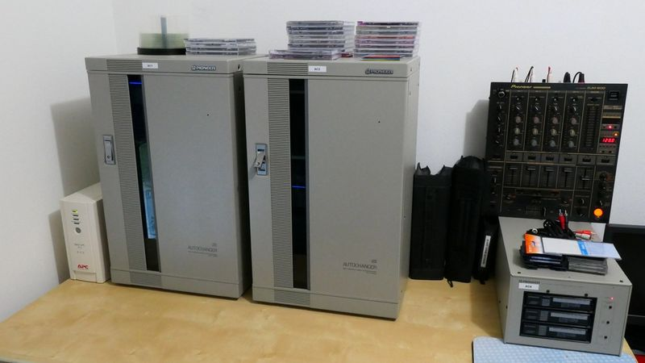

# CAC Control Center (CCC)

## For beginners / Ressources

* See the [startupGuide.pdf](./startupGuide.pdf) document for quick start guide about Pioneer autochangers hardware.

* Official user manuals from Pioneer are located in the [manuals](./manuals/) directory.

* Serial programming manuals are located in the [programming](./programming/) directory.

* You can download and use the interactive [serialcheck.sh](./serialcheck.sh) Bash script to test your autochanger easily on Linux.

* CCC is not an official Pioneer software. This repository contains only documentation and some basic tools.

## At a glance

`CAC` is an accronym for dedicated Pioneer commercial Compact Disc Autochangers. Known models are : CAC-V180M, V3000, V3200 and V5000. Theses changers can only controlled by a computer. `CAC Control Center` is a software suite to use theses changers. CCC is organised in modules (not all fully developed yet). This is the root directory for each modules of the CCC project. To understand CCC modules take a look at them (low level to high level) :

| module | description|
|-|-|
| [pivot](https://github.com/duprej/cccpivot) | Node.js script which start a server to control a changer via RS-232C/422A through a websocket in web browsers.|
| [launcher](https://github.com/duprej/ccclauncher) | Perl script to easily manage (start/status/stop) pivot instances like a Linux deamon.|
| [tester](https://github.com/duprej/ccctester) | Static english web HTML/CSS/JS application to test and debug Node.js pivot instances.|
| web | Big application with Postgres database connection and persistance.|

## The “pivot” concept

CCC is a web-based JavaScript software suite, application "modules" runs in a web browser like Chrome, Brave, Opera or Firefox. But all of them can’t talk easily with a serial port (before USB accessibility API was developped). This is why there is a module named CCCpivot on all webapps will rely on. This make a bridge between the RS-232C/422A autochanger connection and the TCP/IP/Ethernet network world.

With this solution, your changers can be controlled remotely on your LAN/WLAN in all rooms of your house with PCs, tablets or smartphones.

## Topologies/Urbanisation

CCC is a complex architecture for reguler users but powerful and versatile. Modules can be distributed where you want. Of course you can put all modules on an unique computer for easy use.

## Differences in planned webapps

Complexity and features will grow crescendo.

| application   | complexity | i18n | multiple changers  | persistance | status collection |
|---------------|------------|------|--------------------|-------------| ------------------|
| CCCtester     | low        | no   | no                 | no          | simple JS timer |
| CCCweb        | high       | yes  | yes                | yes         | smart/efficient |

## Hardware

You can use a real PC or a Single Board Computer (like a Raspberry Pi / Orange Pi / Banana Pi...) that will act as a tiny server and connects your autochangers with RS-232C/422A<->USB adapters. For my part, I used an old Dell laptop like this :

## Linux first

This software/scripts are written to be used in a Linux environment. I planed to use a Raspberry Pi in the long term for its simplicity, fair price, free software and energy consumption efficiency. I just share the work I have done with my autochangers at home. Windows & MacOS support are clearly not my priority for now.

For Raspberry Pi see the [raspberry.md](./raspberry.md) document.

## Classical set up

* Install Linux with or without a Desktop Environment (prefer Ubuntu/Debian or Raspbian/Armbian) with bash and Perl.
* Test with [serialcheck.sh](./serialcheck.sh) tool.
* Install CCCpivot module (needs Node.js to be installed)
* Install CCClauncher module (needs Perl to be installed)
  * Edit /etc/cccchangers.csv (<- Add your autochangers here)
  * Edit /etc/cccclauncher.cfg (check)
* Launch CCCpivot instances with CCClauncher Perl script
* Install/Use CCCtester module
* Install/Use CCCweb module (needs Postgres & Node.js installed first)

Notes :

* consult the readme.md file located in each CCC modules reporitories.
* some modules are not developped yet when creating this file.
